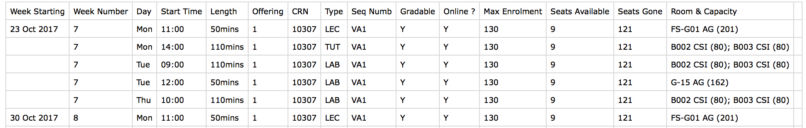
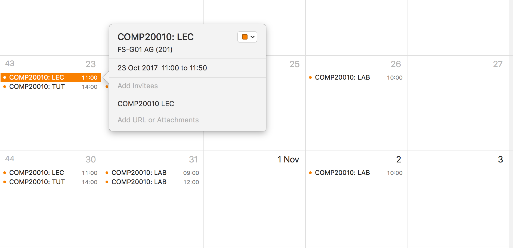

# Convert your Timetable to iCal

Infohub provides this

with no way to convert to a sensible calendar format.

To convert the Infohub timetable to iCalendar format:

1. download the timetable CSV file (eg. `CM801-5.csv`) from Infohub (`Export to Excel` at bottom of page)
2. install the python package:
    - `pip install git+https://github.com/insight-ucd/ucd_timetable_to_ical.git`
3. and run it:
    - `timetable_to_ical --module=COMP20010 --input=CM801-5.csv`
4. You need to tell it the module name, because this is not encoded by Infohub in the CSV file.

If this runs successfully, you will have a file `COMP20010.ics` in the current directory, which you can easily import to iCal and synchronise with all your devices:

# Suggestions

Any suggestions to modify or improve it are welcome. The script is pretty simple, and it is easy to add other information into the event.
